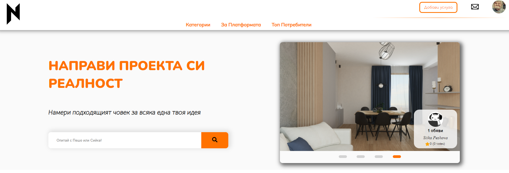
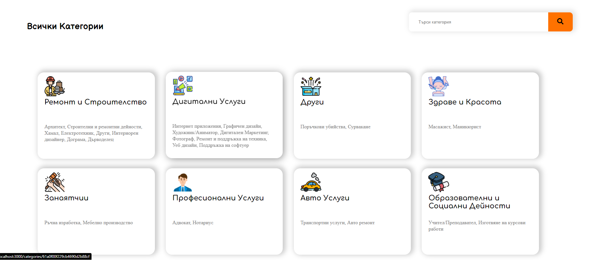
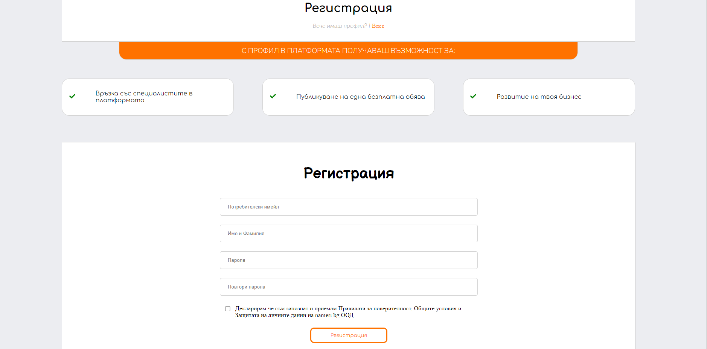
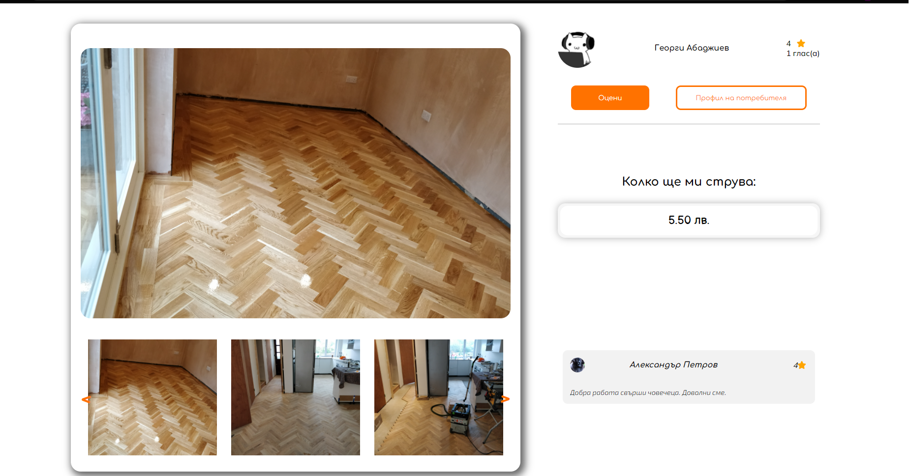

<h2 align="center"><i>Nameri.bg </i></h3>

      <a href="https://https://nameri-bg.vercel.app">
    
    

    
    

    
    

    
    

    </a>

<h4 align="center"><i>Stack: </i></h3>

Nameri.bg is an app for sharing listings offered by people who can for people who need. Inside the app you can find all kind of services, wherever you need a fix in your appartment or a logo for your new company.
The goal is to connect the people and help them find the perfect professional for the job.

Features of the platform (as is, will be updated as we add more features.)

- <i><b>Home page with carousel, top listings, popular categories and categories with most subcategories</b></i>
- <i><b>Auth (Register, Login)</b></i>
- <i><b>-</b></i>
- <i><b>Create listing</b></i>
- <i><b>Update listing (only only)</b></i>
- <i><b>Delete listing (owner only)</b></i>
- <i><b>Listing details with carousel</b></i>
- <i><b>Similar listings functionality</b></i>
- <i><b>-</b></i>
- <i><b>Categories page</b></i>
- <i><b>Subcategories in a category Page</b></i>
- <i><b>-</b></i>
- <i><b>Profile page</b></i>
- <i><b>Edit profile page (change password, profile images, etc...)</b></i>
- <i><b>User rating functionality (write review and rate user)</b></i>
- <i><b>Top users page and functionality</b></i>
- <i><b>-</b></i>
- <i><b>Message functionality</b></i>
- <i><b>Global and page search (some pages, acts like filter)</b></i>
- <i><b>-</b></i>
- <i><b>others (images placeholders when loading, funny 404 page, etc.)</b></i>

The repo includes the "<i>back-end</i>" and the "<i>front-end</i>" of the app.

The React JS SPA app is written from <b>scratch</b> with absolute minimal dependencies besides the one which come with the Create-React-App.
Those are:

- React Router v6
- js-cookie for parsing cookies (specifically parsing JWT token cookie)
- JWT-decode - for decoding the JWT token
- styled-components (bonus requirement for the project assign), used for several components just to mark it as done.
- react-icons

The REST API is written on Express JS

Hosted at <a href="https://nameri-bg.vercel.app/"/>https://nameri-bg.vercel.app